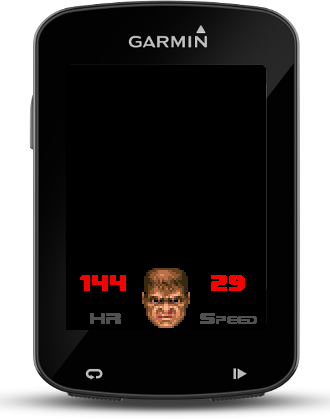

# Garmin-DoomDataField
This is a data field for Garmin devices that's heavily inspired by the classic Doom game.
You get some visual suffer score feedback and other data fields as usual.



## Setup
All you'll need to get started is edit the ```properties.mk``` file. Here's a description of the variables:

- **DEVICE** - device type you want to use for simulation (e.g. fenix3, vivoactive, epix...)
- **SDK_HOME** - home folder of your SDK (e.g. /Users/me/connectiq-sdk-mac-3.0.4)
- **PRIVATE_KEY** - path to your generated RSA private key for signing apps (needed since CIQ 1.3) (e.g. `$HOME.ssh/id_rsa_garmin.der`)
- **DEPLOY** - if you want to hot-deploy to your device, that's the mounted path for the APPS folder (e.g. /Volumes/GARMIN/GARMIN/APPS/)

You can use `openssl` to create a brand new RSA private key in the DER format if you don't have one yet:
```
openssl genrsa -out developer_key.pem 4096
openssl pkcs8 -topk8 -inform PEM -outform DER -in developer_key.pem -out developer_key.der -nocrypt
mv developer_key.der ~/.ssh/id_rsa_garmin.der
```

## Makefile targets
- **build** - compiles the app
- **buildall** - compiles the app separately for every device in the SUPPORTED_DEVICES_LIST, packaging appropriate resources. Make sure to have your resource folders named correctly (e.g. /resources-fenix3_hr)
- **run** - compiles and starts the simulator
- **deploy** - if your device is connected via USB, compile and deploy the app to the device
- **package** - create an .iq file for app store submission
